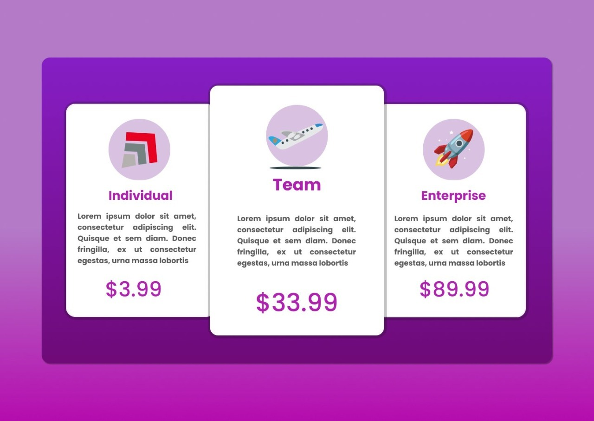

# DISEÑO DE CARDS CON HTML Y CSS
Creación de una plantilla vista en Twitter lo mas parecida a la imagen original.

### FORMA DE UTILIZACIÓN

DEBES UTILIZAR LA EXTENSION DE VSCODE LIVE SHARED
EJECUTARLO DE FROMA LOCAL.

